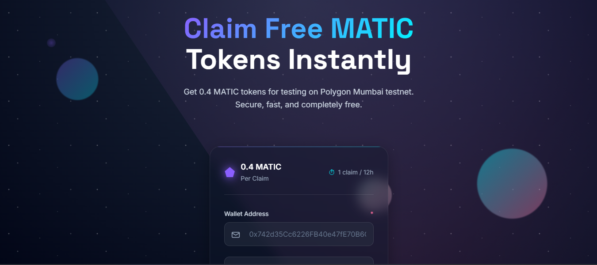

# Polygon MATIC Faucet 🚀

> A futuristic, glassmorphic Web3 faucet for distributing MATIC tokens on Polygon Mumbai testnet

## ✨ Features

- 🎨 **Futuristic Glassmorphic UI** - Modern, sleek design with advanced CSS effects
- 🔥 **Free MATIC Tokens** - Claim 0.4 MATIC tokens for testing
- 🤖 **Bot Protection** - Google reCAPTCHA verification
- ⏱️ **Smart Rate Limiting** - 1 claim per IP every 12 hours
- 🔐 **Secure** - Direct blockchain interaction with ethers.js
- 📱 **Responsive Design** - Works perfectly on all devices
- 🌟 **Smooth Animations** - Interactive cosmic-themed effects

## 🖼️ Screenshots


*Futuristic glassmorphic interface with cosmic background*

## 🚀 Quick Start

```bash
# Clone the repository
git clone https://github.com/abdoulaahmad/polygon-faucet.git
cd polygon-faucet

# Install dependencies
npm install

# Setup environment variables
cp .env.example .env
# Edit .env with your actual values

# Start the development server
npm run dev
```

Visit `http://localhost:3000` to see your faucet in action! 🎉

## 📋 Prerequisites

- **Node.js** v16 or higher
- **npm** or yarn
- **Polygon Mumbai testnet wallet** with MATIC for gas fees
- **Google reCAPTCHA keys** (site key and secret key)

## ⚙️ Environment Setup

Create a `.env` file with the following variables:

```env
# Server Configuration
PORT=3000

# Blockchain Configuration  
RPC_URL=https://rpc-mumbai.maticvigil.com
PRIVATE_KEY=your_wallet_private_key_here

# Google reCAPTCHA Configuration
CAPTCHA_SECRET_KEY=your_recaptcha_secret_key
CAPTCHA_SITE_KEY=your_recaptcha_site_key

# Faucet Settings
FAUCET_AMOUNT=0.4
RATE_LIMIT_WINDOW=43200000  # 12 hours in milliseconds
RATE_LIMIT_MAX=1
```

### 🔑 Getting reCAPTCHA Keys

1. Visit [Google reCAPTCHA Admin](https://www.google.com/recaptcha/admin)
2. Create a new reCAPTCHA v2 site
3. Add your domain (or `localhost` for development)
4. Copy the site key and secret key to your `.env` file
5. Update `data-sitekey` in `public/index.html`

### 💰 Wallet Setup

1. Create a **dedicated wallet** for the faucet (never use your main wallet)
2. Fund it with MATIC on Mumbai testnet
3. Export the private key and add to `.env`
4. **⚠️ NEVER commit your `.env` file!**

## 🏗️ Project Structure

```
polygon-faucet/
├── src/
│   ├── app.ts                     # Express server entry point
│   ├── controllers/               # Request handlers
│   ├── middleware/                # Rate limiting & CAPTCHA verification  
│   ├── services/                  # Blockchain & wallet services
│   ├── routes/                    # API route definitions
│   ├── utils/                     # Helper functions & config
│   └── types/                     # TypeScript interfaces
├── public/                        # Frontend assets
│   ├── index.html                 # Futuristic glassmorphic UI
│   ├── style.css                  # Advanced CSS with animations
│   └── script.js                  # Interactive JavaScript
├── dist/                          # Compiled TypeScript output
└── docs/                          # Documentation & screenshots
```

## 🛠️ Available Scripts

```bash
npm run dev      # Start development server with hot reload
npm run build    # Compile TypeScript to JavaScript  
npm start        # Start production server
npm test         # Run test suite (when implemented)
```

## 🌐 API Documentation

### POST `/api/faucet/claim`
Claims MATIC tokens for a wallet address.

**Request:**
```json
{
  "walletAddress": "0x742d35Cc6226FB40e47fE70B6C1d57E1776e6df5",
  "captcha": "recaptcha_response_token"
}
```

**Response:**
```json
{
  "success": true,
  "message": "Tokens claimed successfully!",
  "transactionId": "0x...",
  "amount": 0.4
}
```

## 🔒 Security Features

- **Smart Rate Limiting** - 1 request per IP every 12 hours
- **reCAPTCHA Integration** - Prevents bot abuse
- **Input Validation** - Comprehensive wallet address validation
- **Error Handling** - Graceful error management
- **Environment Security** - Sensitive data in environment variables

## 🐛 Troubleshooting

<details>
<summary>Common Issues & Solutions</summary>

### "Cannot find module" errors
```bash
rm -rf node_modules package-lock.json
npm install
```

### "Invalid private key" errors  
- Ensure private key is 64 hex characters (no "0x" prefix)
- Use a dedicated testnet wallet, never your main wallet

### CAPTCHA verification fails
- Verify reCAPTCHA secret key is correct
- Check site key matches your domain
- Ensure reCAPTCHA v2 is being used

### Transaction failures
- Check faucet wallet has sufficient MATIC for gas
- Verify RPC URL is responsive
- Monitor Mumbai testnet status

</details>

## 🤝 Contributing

We welcome contributions! Please see our [Contributing Guidelines](CONTRIBUTING.md).

1. **Fork** the repository
2. **Create** a feature branch (`git checkout -b feature/amazing-feature`)
3. **Commit** your changes (`git commit -m 'Add amazing feature'`)
4. **Push** to the branch (`git push origin feature/amazing-feature`)  
5. **Open** a Pull Request

## 📜 License

This project is licensed under the **MIT License** - see the [LICENSE](LICENSE) file for details.

## 🙏 Acknowledgments

- **Polygon** team for the amazing Mumbai testnet
- **ethers.js** for blockchain interaction
- **Google reCAPTCHA** for bot protection
- The **Web3 community** for inspiration

## ⭐ Support

If this project helped you, please give it a ⭐ on GitHub!

---

<div align="center">

**Built with ❤️ for the Web3 community**

[🌐 Live Demo](https://your-faucet-domain.com) • [📖 Documentation](./docs) • [🐛 Report Bug](../../issues) • [💡 Request Feature](../../issues)

</div>